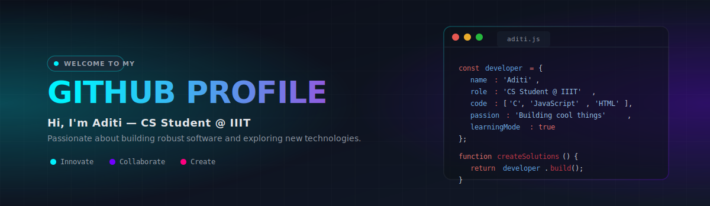

# Aditi Rakesh

  

## About Me

I am a Computer Science student at IIIT. I enjoy systems-level programming, web development, and exploring how software works under the hood.

- **Academics:** Studying Computer Science at IIIT.
- **Interests:** Systems programming in C, responsive web interface design, and algorithms.
- **Projects:** Focused on building clean, practical applications for coursework and personal learning.

---

## Projects

### Semester 4
* **Miles and Moments** ([View Repo](https://github.com/Aditirakesh/miles-and-moments))
  A responsive travel blog and interactive city guide showcasing global travel destinations, itineraries, and packing lists. Built using custom HTML5 and CSS3.
* **Spectral** ([View Repo](https://github.com/Aditirakesh/Spectral))
  An interactive, visually-rich JavaScript web application.
* **AquaWorld** ([View Repo](https://github.com/Aditirakesh/AquaWorld))
  A systems-level exploration and simulation project developed in C.

### Semester 3
* **SkillSync** ([View Repo](https://github.com/Aditirakesh/SkillSync))
  A collaborative skill-matching web application built with JavaScript.

---

## Skills

* **Languages:** C, JavaScript, HTML5, CSS3, SQL
* **Tools & Environment:** Git, GitHub, Linux, VS Code

---

## GitHub Stats

  
  &nbsp;&nbsp;
  

